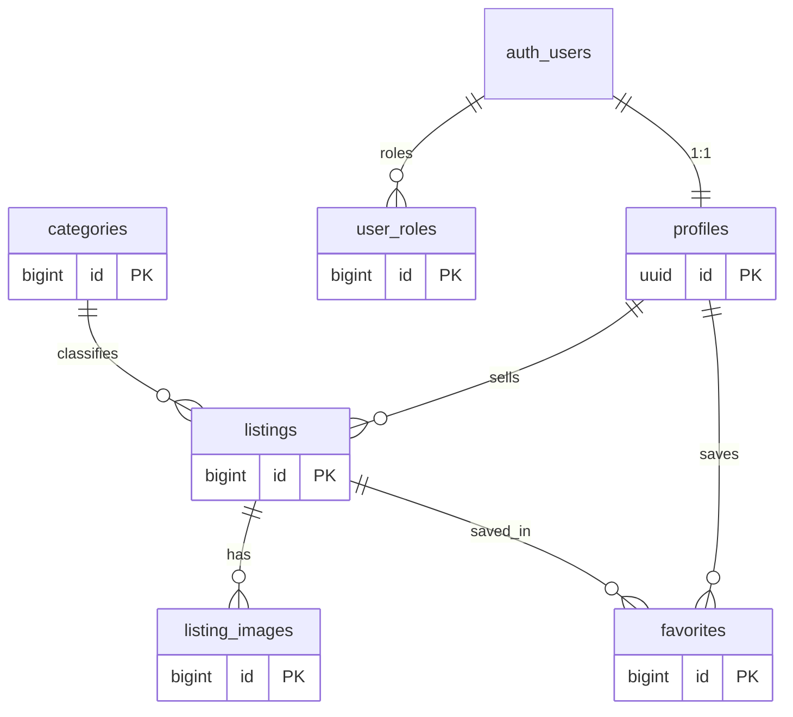

# ⚡ VoltMarket — пазар за електрически автомобили

VoltMarket е многостранично уеб приложение за **купуване и продаване на електрически
автомобили**. Потребители се регистрират, публикуват обяви със снимки и EV-специфични
спецификации (батерия, обхват, пробег), запазват любими и филтрират по категории. Всяка
нова обява минава през **модерация от администратор**, преди да бъде публикувана.

> Капстон проект за курса **„Software Technologies with AI"** (SoftUni AI) — изграден с
> AI-assisted development (GitHub Copilot / Claude), Vite и Supabase.

---

## 🔗 Live demo

- **Live URL:** _(добавя се след deploy в Netlify)_
- **Демо профил (купувач):** `demo@voltmarket.dev` / `demo123`
- **Демо администратор:** `admin@voltmarket.dev` / `admin123`

---

## ✨ Функционалности

- 🔐 Регистрация / вход / изход (Supabase Auth, JWT)
- 👤 Потребителски профили с профилна снимка
- 🚗 Публикуване, редакция и изтриване на обяви със снимки
- 🔋 EV-специфични полета: батерия (kWh), обхват (км), пробег, състояние
- 🔎 Търсене и филтри (категория, цена, обхват, състояние, подредба)
- ❤️ Запазване на любими обяви
- 🛡️ **Admin панел** — модерация на обяви (одобри/отхвърли) и управление на роли
- 🗂️ Ролев достъп с **Row-Level Security** политики (сигурността е в базата, не в клиента)
- 📱 Responsive дизайн (Bootstrap 5) за десктоп и мобилни устройства

---

## 🧱 Архитектура

Клиент-сървър архитектура: **vanilla JS фронтенд** ↔ **Supabase бекенд** през REST API.

```
┌─────────────────────────────┐        ┌────────────────────────────┐
│  Браузър (Vite multi-page)  │        │          Supabase          │
│                             │  REST  │                            │
│  pages/ ── services/ ───────┼──────► │  Postgres + RLS            │
│     │         │             │  JWT   │  Auth (users, JWT)         │
│  components/  lib/supabase  │◄──────►│  Storage (снимки)          │
└─────────────────────────────┘        └────────────────────────────┘
```

- **Multi-page**, не SPA: всеки екран е отделен `*.html` файл със свой entry модул.
- **Слоеста структура:** UI (`pages`/`components`) → `services` (единствен достъп до Supabase) → `lib` (клиент).
- **Технологии:** HTML, CSS, JavaScript (ES modules), Bootstrap 5, Bootstrap Icons, Vite, Supabase, Netlify.

---

## 🗄️ Схема на базата данни

6 таблици с релации, RLS върху всяка.



| Таблица | Предназначение |
|---|---|
| `profiles` | Потребителски профил (1:1 с `auth.users`), аватар, контакти |
| `categories` | Тип каросерия (Седан, SUV, Хечбек…) |
| `listings` | Обяви за автомобили + EV спецификации + статус (pending/approved/rejected/sold) |
| `listing_images` | Снимки към обява (в Supabase Storage) |
| `favorites` | Запазени обяви (many-to-many профил ↔ обява) |
| `user_roles` | Роли за RBAC (`admin`) |

**Сигурност:** `is_admin()` (SECURITY DEFINER) + RLS политики + `enforce_listing_rules()`
тригер, който налага модерацията сървърно (нова обява винаги е `pending`; само админ
одобрява). SQL-ът е в [`supabase/migrations/`](supabase/migrations/).

---

## 🚀 Локална разработка

### 1. Инсталирай зависимостите
```bash
npm install
```

### 2. Настрой Supabase
1. Създай проект в [supabase.com](https://supabase.com).
2. В **SQL Editor** изпълни по ред файловете от `supabase/migrations/` (schema → rls → storage),
   след това `supabase/seed.sql`.
3. **Authentication → Providers → Email**: изключи *Confirm email* (за да работи демо логинът веднага).
4. Регистрирай администраторския профил през приложението, после в SQL Editor изпълни snippet-а
   за bootstrap на админ от `supabase/seed.sql`.

### 3. Конфигурирай `.env`
```bash
cp .env.example .env
# попълни:
# VITE_SUPABASE_URL=https://xxxx.supabase.co
# VITE_SUPABASE_ANON_KEY=...
```

### 4. Стартирай
```bash
npm run dev      # dev сървър на http://localhost:5173
npm run build    # production build в dist/
npm run preview  # преглед на build-а
```

---

## 📦 Deploy (Netlify)

- **Build command:** `npm run build`
- **Publish directory:** `dist`
- **Environment variables:** `VITE_SUPABASE_URL`, `VITE_SUPABASE_ANON_KEY`

Конфигурацията е в [`netlify.toml`](netlify.toml).

---

## 📁 Ключови папки и файлове

| Път | Предназначение |
|---|---|
| `*.html` (root) | 9-те екрана (входни точки за Vite) |
| `vite.config.js` | Multi-page конфигурация (`rollupOptions.input`) |
| `src/lib/supabaseClient.js` | Инициализация на Supabase клиента |
| `src/lib/theme.js` | Импорт на Bootstrap + стилове |
| `src/services/` | Достъп до данни (auth, listings, favorites, storage, admin, categories) |
| `src/pages/` | Логика на всеки екран |
| `src/components/` | Преизползваеми UI компоненти (navbar, footer, toast, listing card, uploader) |
| `src/utils/` | Помощни функции (dom, format, validation, guards, errors) |
| `src/styles/main.css` | Тема и стилове |
| `supabase/migrations/` | SQL миграции (схема, RLS, storage) |
| `supabase/seed.sql` | Начални данни (категории) + bootstrap на админ |
| `.github/copilot-instructions.md` | Инструкции за AI dev агента |

---

## 🖥️ Екрани

Начало/търсене · Детайл на обява · Нова обява · Редакция · Моето табло · Вход · Регистрация · Профил · Админ панел
